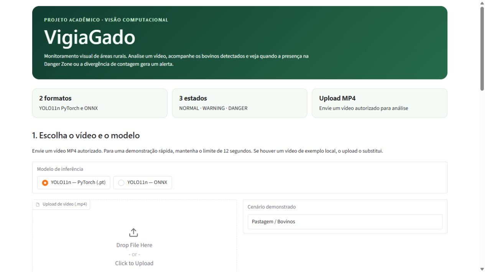

# VigiaGado

Projeto acadêmico de visão computacional para monitoramento visual de áreas rurais. A aplicação recebe um vídeo MP4, detecta objetos com YOLO11n, conta bovinos visíveis, observa uma **Danger Zone** e registra alertas após persistência temporal. A interface Gradio permite escolher a inferência **PyTorch** ou **ONNX Runtime** sem mudar o restante da análise.

Esta é uma release candidate preparada para repositório e deploy. A validação funcional foi feita localmente em Windows; **o deploy público no Render/Linux ainda não foi testado**. O vídeo bovino usado na validação foi excluído da distribuição porque seu direito de redistribuição não está confirmado. Para demonstrar, envie um MP4 autorizado pela interface.

## Visão geral e funcionalidades

- Detecção YOLO11n em vídeo, com boxes e saída MP4 anotada.
- Seleção explícita entre `models/yolo11n.pt` e `models/yolo11n.onnx` por ONNX Runtime real.
- Contagem visual de bovinos, deduplicação espacial por frame e referência opcional de quantidade esperada.
- Danger Zone retangular configurável, eventos persistentes e estados `NORMAL`, `WARNING` e `DANGER`.
- Upload MP4, prévia da zona, resultado em vídeo, contagens, motivos, eventos e JSON técnico na interface Gradio.

As categorias de ameaça e intruso dependem do cenário. O vídeo bovino validado produziu `WARNING` por presença de bovinos na zona; não houve demonstração com predador real. Os alertas são apoio à análise visual, não confirmação de perigo físico.

## Demonstração

| Recurso | Endereço |
|---|---|
| Site publicado | `SITE_URL_AQUI` |
| Captura da interface | [Tela inicial](docs/interface.png) |
| Vídeo/GIF autorizado | `VIDEO_DEMO_AQUI` |

Os marcadores de site e vídeo devem ser substituídos somente depois da publicação dos respectivos materiais. A captura mostra a versão sem vídeo pré-carregado. Nenhum vídeo é incluído neste repositório. Para uma apresentação local, use o upload com um MP4 de sua autoria ou com permissão de uso; um arquivo autorizado chamado `samples/gado5.mp4` ou `samples/gado1.mp4` também aparece automaticamente como opção local, mas é ignorado pelo Git.



## Arquitetura

```text
MP4 → leitura/normalização → YOLO11n PT ou ONNX → detecções
    → deduplicação → Danger Zone → persistência → eventos/estado
    → vídeo H.264 anotado + CSV/JSON + visualização Gradio
```

`vigia_core.py` contém inferência, contagem, regra de zona, estados e processamento. `app.py` monta a interface e apresenta o resultado. Não há modelo rural treinado nesta versão.

## Modelos e ONNX

| Seletor | Arquivos necessários | Execução |
|---|---|---|
| YOLO11n PyTorch | `models/yolo11n.pt` | Ultralytics/PyTorch |
| YOLO11n ONNX | `models/yolo11n.onnx` **e** `models/yolo11n.onnx.data` | Ultralytics com ONNX Runtime |

Os três arquivos estão incluídos; o aplicativo não exporta nem baixa modelos ao iniciar. O formato ONNX demonstra interoperabilidade e um runtime distinto do PyTorch, como parte da comparação acadêmica. As saídas não são matematicamente idênticas: na validação de um frame houve 8 detecções em cada backend e IoU médio de 0,9625 entre os 8 pares de caixas; isso não é uma garantia para outros vídeos.

`setup_models.py` é **opcional**. Ele pode obter o peso YOLO11n oficial se faltar o `.pt`, exportar ONNX se faltar o grafo e comparar os modelos em um frame. Para executar a comparação, forneça antes um MP4 local autorizado em `samples/gado5.mp4` ou `samples/gado1.mp4`; sem vídeo, o script informa a ausência do arquivo. O deploy usa os modelos incluídos e não executa esse script.

## Danger Zone

A zona usa coordenadas normalizadas `(x1, y1, x2, y2)`, entre 0 e 1. Uma detecção entra na zona quando o **ponto central inferior** da caixa está dentro dela **ou** quando a interseção cobre pelo menos **15% da área da própria caixa**. A mesma regra alimenta overlay, contagem e alertas. Um contato mínimo abaixo do limiar não conta. Eventos só são confirmados após persistência temporal; sem tracking, a persistência indica presença agregada, não a identidade do mesmo animal.

## Dataset Rural

O dataset preparado separadamente reúne **998 imagens** (499 `wild_boar`, 499 `jaguar`) e **1.241 bounding boxes** no formato YOLO. Os IDs do mapa são `0 cow`, `1 wild_boar`, `2 jaguar`, `3 wolf` reservado, `4 person` e `5 dog`. `wolf` não foi adquirido nesta etapa. O split é **798 train / 101 val / 99 test**, atribuído por `group_id` dentro de cada classe para evitar cruzamento de sequências entre splits. Isso reduz vazamento por sequência, mas não elimina semelhanças entre grupos da mesma câmera.

As fontes são [SWG Camera Traps 2018–2020](https://lila.science/datasets/swg-camera-traps) para javali e [WCS Camera Traps](https://lila.science/datasets/wcscameratraps) para onça. Ambas declaram **Community Data License Agreement, variante permissiva** em suas páginas; consulte as condições e citações originais. Parte dos rótulos WCS vem do nível da sequência. A auditoria automatizada do dataset completo passou sem erros, mas o manifesto mantém `reviewed=false` porque não houve revisão visual individual das 998 imagens.

**Dataset completo:** `DATASET_URL_AQUI` (link externo ainda não publicado). O repositório inclui somente `dataset_rural/data.yaml`, `dataset_rural/manifest.csv`, candidatos e metadados pequenos em `dataset_staging/`, scripts e relatórios. Imagens, rótulos e metadados brutos grandes ficam fora do GitHub e do deploy. Ao obter o pacote externo, extraia as pastas `dataset_rural/images/` e `dataset_rural/labels/` sob a raiz do projeto para que os caminhos do manifesto funcionem. A reconstrução completa a partir dos scripts exige também os metadados brutos das fontes em `dataset_staging/_metadata/`, incluídos apenas no arquivo externo do checkpoint.

**Nenhum treinamento ou fine-tuning rural foi realizado.** Os modelos PT/ONNX desta aplicação são YOLO11n existentes e não aprenderam as classes `wild_boar` ou `jaguar` a partir desse dataset. Consulte [o relatório do dataset](reports/dataset_report.md) para origem, conversão, contagens e limitações.

## Estrutura do repositório

```text
VigiaGado/
├── app.py, vigia_core.py, setup_models.py
├── requirements.txt, render.yaml, .python-version
├── models/                 # PT, ONNX e dados externos ONNX
├── samples/                # instruções; nenhum vídeo distribuído
├── tests/                  # regressões do core
├── tools/                  # preparação/validação do dataset externo
├── dataset_rural/          # data.yaml, manifest.csv, instruções
├── dataset_staging/        # candidatos e metadados pequenos
├── reports/                # validações e histórico
├── LICENSES_AND_SOURCES.md
├── DEPLOY_GUIDE.md
└── GITHUB_DELIVERY_CHECKLIST.md
```

Os relatórios históricos mencionam um vídeo e uma etapa em que o dataset estava vazio; [o índice dos relatórios](reports/README.md) esclarece as datas e o estado atual.

## Requisitos e instalação local

Use **Python 3.12** (o projeto também foi documentado para 3.11), espaço para os modelos e dependências, e acesso à internet para instalar os pacotes. Tecnologias principais: Python, Ultralytics/YOLO11n, PyTorch, OpenCV, ONNX Runtime e Gradio. `imageio-ffmpeg` fornece a codificação de vídeo. O teste local de instalação passou com `requirements.txt`; as faixas de algumas dependências permitem versões futuras, portanto não são um lock exato.

```bash
git clone REPOSITORY_URL_AQUI
cd VigiaGado
python -m venv .venv
# Ative a venv conforme seu sistema; então:
python -m pip install -r requirements.txt
python app.py
```

Abra o endereço local exibido no terminal (porta padrão **7860**). Alternativamente, defina `PORT` antes da inicialização. O aplicativo escuta em `0.0.0.0`; não precisa do dataset rural nem baixa gigabytes no início.

## Uso

1. Abra a interface e escolha **YOLO11n PyTorch** ou **YOLO11n ONNX**.
2. Envie um MP4 que você pode usar. Sem upload, a aplicação só oferece um vídeo de exemplo se ele existir localmente em `samples/`.
3. Confira a prévia e ajuste os quatro limites da Danger Zone, mantendo `X1 < X2` e `Y1 < Y2`.
4. Ajuste confiança, duração do trecho e, se desejado, número de bovinos esperados.
5. Clique em **Analisar vídeo**. Veja status, motivo, contagens, eventos, vídeo anotado e JSON técnico.

O processamento grava `VigiaGado_demo.mp4`, `contagens.csv`, `detections.json`, `eventos.json` e `resumo.json` em `resultados/`, pasta ignorada pelo Git. Os resultados em um serviço Render são temporários.

## Deploy no Render

Conecte um repositório criado a partir **desta pasta**, usando o `render.yaml` incluído como Blueprint ou um Web Service Python. O build do Blueprint instala PyTorch/torchvision CPU e depois `requirements.txt`; o start é `python app.py`. O Gradio lê `PORT` e faz bind em `0.0.0.0`. O deploy inclui código e modelos, mas **não** dataset completo nem vídeo de demonstração; o usuário final fará upload de MP4. O plano escolhido precisa comportar PyTorch, ONNX Runtime e processamento de vídeo em memória. Consulte [DEPLOY_GUIDE.md](DEPLOY_GUIDE.md) para passos e verificação pós-publicação.

**Status:** a configuração foi preparada e o aplicativo foi testado localmente, porém **nenhum build ou teste funcional Render/Linux foi realizado**. Substitua `SITE_URL_AQUI` só depois do deploy real e de executar PT e ONNX no serviço.

## Validação e reprodutibilidade

Na validação final local: instalação de `requirements.txt` e `pip check` passaram; Gradio respondeu HTTP 200; PT e ONNX processaram 96 frames cada em trechos de 8 s com saída H.264 decodificável; upload pela API Gradio funcionou; `CPUExecutionProvider` foi observado no ONNX Runtime; os **5 testes** existentes passaram. A configuração atual de distribuição remove apenas o vídeo sem direito de redistribuição confirmado e ajusta textos de interface para upload obrigatório. Consulte [FINAL_VALIDATION_REPORT.md](reports/FINAL_VALIDATION_REPORT.md) para a evidência e as limitações do checkpoint validado.

Para verificar as regras sem vídeo, execute `python -m unittest discover -s tests -v`. Para repetir a inferência, forneça seu próprio MP4 autorizado. Os arquivos externos do dataset devem preservar a estrutura indicada em `dataset_rural/README.md`; só então rode `python tools/validate_rural_dataset.py`. A pipeline de preparação em `tools/` depende dos CSVs de candidatos e dos metadados brutos externos.

## Limitações

Contagens são estimativas: oclusão, boxes fragmentados e duplicatas residuais podem afetar os resultados. Não há tracking nem avaliação de campo. PT e ONNX podem divergir. Somente o cenário bovino foi exercitado em vídeo real; o estado `DANGER` foi testado em regras, sem vídeo de ameaça real. O dataset rural está preparado e validado, mas **não** foi usado para treinamento e não existe modelo rural customizado nesta entrega. `chicken_coop` e `crop` são estruturas futuras, não cenários validados. A permissão de redistribuir o vídeo bovino original segue pendente.

## Créditos, fontes e licenças

Este é um projeto acadêmico; o checkpoint não identifica instituição, professor ou disciplina. Fontes e termos de código próprio, Ultralytics/modelos, datasets e vídeo estão separados em [LICENSES_AND_SOURCES.md](LICENSES_AND_SOURCES.md). **Nenhuma licença global foi atribuída ao projeto.** Antes de publicar, os autores devem decidir os termos do código próprio, cumprir os termos aplicáveis do Ultralytics e confirmar a origem de qualquer mídia adicionada.
